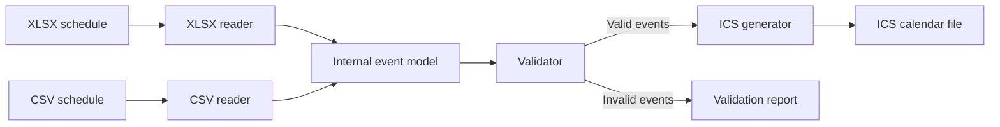

# Implementation Decisions

## Purpose

This document records the agreed implementation architecture for the calendar-conversion project. Detailed implementation choices will be added later.

## Architecture

The application accepts schedules in **XLSX** or **CSV** format. Each input reader converts its source into a shared **internal event model**. The events are then validated and passed to the **ICS** generator.

The CSV format can be used directly as an input format or exported as an intermediate representation for inspection.

## Components

1. **XLSX reader**
   - Reads schedules that follow the project's workbook template.
   - Converts spreadsheet rows into the internal event model.

2. **CSV reader**
   - Reads normalized calendar data from a CSV file.
   - Converts CSV rows into the internal event model.

3. **Internal event model**
   - Provides one common representation independent of the input format.
   - Connects the input readers, validator, and ICS generator.

4. **Validator**
   - Validates the normalized events before calendar generation.
   - Returns validation errors associated with their source rows.

5. **ICS generator**
   - Converts validated events into an iCalendar file.

6. **Application interface**
   - Selects the appropriate reader from the input file type.
   - Coordinates reading, validation, and output generation.

## Normalized event fields

The initial event representation contains:

- `ID`
- `SUMMARY`
- `START_DATE`
- `START_TIME`
- `END_DATE`
- `END_TIME`
- `LOCATION`
- `DESCRIPTION`

## Implementation sequence

1. Build the internal event model.
2. Build CSV input and ICS output.
3. Add event validation.
4. Build XLSX input using the same internal event model.
5. Add the application interface around the completed conversion pipeline.

## Conversion workflow

## Programming language

Not yet decided.
