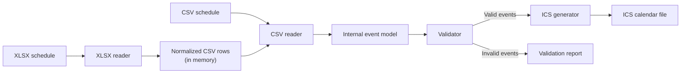

# Implementation Decisions

## Purpose

This document records the agreed implementation architecture for the calendar-conversion project. Detailed implementation choices will be added later.

## Architecture

The application accepts schedules in **XLSX** or **CSV** format. The CSV
reader owns the common conversion into the shared **internal event model**.
The XLSX reader decodes workbook cells, normalizes them into CSV-compatible
rows in memory, and delegates those rows to the CSV reader. The events are
then validated and passed to the **ICS** generator.

The CSV format can be used directly as an input format or exported as an intermediate representation for inspection.

## Components

1. **XLSX reader**
   - Reads schedules that follow the project's workbook template.
   - Normalizes spreadsheet cells and delegates the rows to the CSV reader.

2. **CSV reader**
   - Reads normalized calendar data from a CSV file or the XLSX adapter.
   - Converts normalized rows into the internal event model.

3. **Internal event model**
   - Provides one common representation independent of the input format.
   - Connects normalized input, the validator, and the ICS generator.

4. **Validator**
   - Validates the normalized events before calendar generation.
   - Returns validation errors associated with their source rows.

5. **ICS generator**
   - Converts validated events into an iCalendar file.

6. **Application interface**
   - Selects the appropriate reader from the input file type.
   - Coordinates reading, validation, partial conversion, and reporting.

7. **Structured conversion service**
   - Exposes the complete in-memory conversion pipeline to Python callers.
   - Returns typed results and raises typed fatal input errors.

## Implementation sequence

1. Build the internal event model.
2. Build CSV input and ICS output.
3. Add event validation.
4. Build XLSX input using the same internal event model.
5. Add the application interface around the completed conversion pipeline.

## Conversion workflow



## Programming language

The project uses **Python 3.11 or newer**. Runtime dependencies, including
`openpyxl` for XLSX support, are declared in `pyproject.toml`.

A project-local virtual environment is recommended so these dependencies do
not affect the system Python installation or other projects. Create and set it
up from the project root with:

```bash
python3 -m venv .venv
source .venv/bin/activate
python -m pip install --upgrade pip
python -m pip install -e .
```

The editable installation (`-e`) makes source-code changes immediately
available without reinstalling the package. Verify the active environment and
the XLSX dependency with:

```bash
python --version
python -c "import openpyxl; print(openpyxl.__version__)"
```

The Python version must be at least 3.11, while `openpyxl` must satisfy the
version range declared in `pyproject.toml`. Run `deactivate` when finished.
The `.venv/` directory is local development state and is excluded from Git.

## Internal event model

The shared event model is an immutable, slotted Python `dataclass` named
`Event`. Immutability prevents readers, validators, and generators from
silently changing an event as it moves through the conversion pipeline.

The model contains the requested common fields:

- `id` and `summary` are required strings.
- `location` and `description` are strings and default to an empty string.

It supports two mutually exclusive event shapes selected by `all_day`:

- A timed event (`all_day=False`, the default) requires `start_date`,
  `start_time`, `end_date`, and `end_time`.
- An all-day event (`all_day=True`) requires `start_date` and `end_date` and
  does not accept `start_time` or `end_time`. No separate day fields exist.

All date fields use `datetime.date`, while time fields use `datetime.time`.
For all-day events, `end_date` is inclusive. Therefore, an event covering only
10 July has both `start_date=2026-07-10` and `end_date=2026-07-10`. When the
ICS generator is implemented, it will convert this inclusive value to the
exclusive `DTEND` representation required by iCalendar.

Timed events default to the standard-library `ZoneInfo("Europe/Rome")`
timezone. Keeping a real timezone object instead of a UTC offset ensures that
daylight-saving changes are handled by the system timezone database. All-day
events retain the same default metadata, although their day values do not
represent a time of day.

Python field names use lowercase `snake_case`, following standard Python
conventions. Input readers and output generators are responsible for mapping
these names to uppercase CSV columns and iCalendar properties where needed.

The model enforces only its structural invariant: an event must provide all
fields belonging to exactly one of the two shapes. Business rules such as
required non-empty text, unique IDs, and an end after the start will be
implemented in the validator, as defined by the architecture.

## CSV reader

The normalized CSV reader lives in its own `csv_reader` module and accepts
either a filesystem path or an open text stream. The fields `location` and
`description` are optional; all other columns in the normalized CSV format are
required. The external `all_date` column maps to the model's `all_day` field.

Dates use the unambiguous ISO `YYYY-MM-DD` representation. Times use 24-hour
`HH:MM` or `HH:MM:SS`. The canonical boolean spelling is `true` or `false`,
while `yes`/`no`, `y`/`n`, and `1`/`0` are accepted case-insensitively for
convenience. Unknown values cause an explicit, row-numbered input error.

## XLSX reader

The XLSX reader lives in its own `xlsx_reader` module and uses `openpyxl`, the
project's first third-party runtime dependency, to decode workbooks. It reads
the active worksheet by default and also accepts an explicit worksheet name.
The workbook is opened in read-only, data-only mode so large inputs do not
need to be loaded fully into memory and saved formula results are read rather
than formula expressions.

Worksheet rows are normalized into CSV text in memory and then parsed by the
existing CSV reader. This makes XLSX and CSV use exactly the same required
columns, boolean spellings, date/time formats, optional fields, and structural
checks. Excel-native date, time, datetime, and boolean cell values are
converted to those normalized spellings before delegation. Completely empty
data rows are skipped, with a row mapping retained so an input error still
reports its original worksheet and row number. No temporary CSV file is
created; its extra memory and processing cost is negligible for the intended
human-authored schedules.

## Validator

Semantic validation lives in a separate `validator` module rather than in the
event model or an input reader. This keeps validation consistent for CSV and
future XLSX inputs and allows all issues in an event collection to be reported
together. The validator rejects empty or whitespace-only identifiers and
summaries, reversed date ranges, and reversed times for same-day timed events.
Batch validation annotates each issue with the event's one-based input
position.

Validation and terminal presentation remain separate operations. Callers use
`print_validation_errors` to display every returned issue as a bold red
`Invalid event [id=event-id]: description` message. Each `ValidationIssue`
therefore retains the originating event ID; a missing ID is displayed as
`<empty>`. Keeping output separate means validation can also be reused by
graphical interfaces, tests, and other consumers without unwanted terminal
side effects.

Because iCalendar uses `UID` to identify events, batch validation also rejects
duplicate non-empty event IDs. The issue identifies the later event and the
one-based position where the ID first appeared.

## ICS generator

The ICS generator creates one `VCALENDAR` containing one `VEVENT` component
for every valid event. This is the standard iCalendar mechanism for collecting
events in one importable file; a ZIP archive is not used because calendar
applications can import the `.ics` file directly.

The model's event ID becomes the iCalendar `UID`, and a UTC `DTSTAMP` is added
to every event. Timed events are converted from their stored timezone to UTC,
which preserves the correct instant across Europe/Rome daylight-saving changes
without requiring consumers to interpret a custom timezone definition.
All-day events use date values, and their inclusive model `end_date` is moved
forward by one day because iCalendar defines `DTEND` as exclusive.

Text values are escaped according to iCalendar rules, content lines are folded
at the 75-octet limit without splitting UTF-8 characters, and output uses CRLF
line endings. `generate_ics` returns calendar text, while `write_ics` writes the
same output to a filesystem path or an open text stream. Generation stops with
an `ICSGenerationError` containing the validation issues if any event is
invalid.

## Application interface

The public `calendar_conversion.service` module is the application boundary
for programmatic callers. `convert_schedule` accepts an open binary stream,
the original filename used for format selection, and a calendar name. It does
not persist input or output data. Its immutable `ConversionResult` contains
the UTF-8 ICS text, total/converted/skipped counts, and one `InvalidEvent` for
each skipped event.

Each invalid event contains its one-based event index, original source row,
worksheet name for XLSX inputs, ID, summary, and stable `IssueCode` values.
Fatal format or read failures raise `ConversionError`; callers should branch
on its stable `ConversionErrorCode` rather than parsing its diagnostic message.
CSV errors may include a row, and XLSX errors may include both a row and
worksheet. This separation lets the future web API translate codes into safe
localized messages without exposing parser details.

The CLI opens the selected file as a binary stream, calls the same structured
service, writes the returned ICS text, and renders its established terminal
report. This keeps CLI exit codes and output behavior compatible while
preventing the command-line and web paths from developing separate conversion
logic.

## Command-line interface

The root-level `main.py` is a thin executable wrapper around the reusable
`calendar_conversion.application` module. With no arguments it reads
`events.xlsx` and writes `schedule.ics`; a positional argument selects another
`.xlsx` or `.csv` input, and `--output`/`-o` selects another ICS destination.
Keeping the coordination logic in the package makes it directly testable while
retaining the requested `python main.py` user interface.

The application validates the complete event collection, writes only events
without validation issues, and reports valid and invalid event counts. Each
invalid event is listed once with its ID and summary even when it has multiple
validation issues. A complete conversion exits with status 0, a partial
conversion with status 1, and a fatal read or write failure with status 2.

Report colors depend on the output stream. Interactive terminal output uses
bold cyan for the heading and bold red for the invalid count and event list.
When standard output is redirected, for example with `>> report.txt`, the
stream is not a terminal and the same report is written without ANSI escape
sequences, producing a clean text file.

### Running the application

Run the application from the project root with the virtual environment
activated:

```bash
source .venv/bin/activate
python main.py
```

With no arguments, `events.xlsx` is read from the project root and the result
is written to `schedule.ics`. A different XLSX or CSV input and a different ICS
output can be selected with:

```bash
python main.py another_name.xlsx
python main.py another_name.csv
python main.py another_name.xlsx --output another_schedule.ics
```

The conversion report is printed to standard output. Redirect it with `>` to
replace a report file or `>>` to append to one; redirected reports contain no
ANSI color codes:

```bash
python main.py another_name.xlsx > report.txt
python main.py another_name.xlsx >> report.txt
```

Use `python main.py --help` to display all command-line options and
`deactivate` to leave the virtual environment when finished. Exit status 0
means every event was converted, status 1 means invalid events were skipped,
and status 2 means a fatal input or output error prevented conversion.

## Documentation

Project documentation uses Sphinx with reStructuredText source files in
`docs-source/`. The built-in Sphinx theme and extensions are sufficient: `autodoc`
extracts the public Python API from docstrings, while `napoleon` allows future
docstrings to use readable Google- or NumPy-style sections. The architecture
is illustrated by a repository-owned SVG, avoiding a browser-side diagram
runtime or another Sphinx extension.

Sphinx is declared as the optional `docs` dependency rather than a runtime
dependency because users do not need it to convert calendars. The compatible
range is Sphinx 8.x: the project supports Python 3.11, while Sphinx 9 requires
Python 3.12 or newer. Generated HTML is written directly under `docs/` and
committed so GitHub Pages can publish that directory. A `.nojekyll` marker
ensures Sphinx's underscore-prefixed asset directories are served unchanged;
the reStructuredText, configuration, style sheet, and SVG in `docs-source/`
remain the reproducible documentation source.
