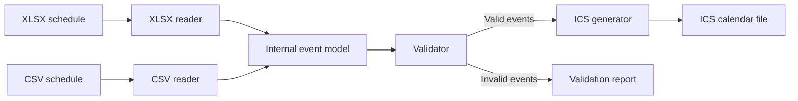

# Implementation Decisions

## Purpose

This document records the agreed implementation architecture for the calendar-conversion project. Detailed implementation choices will be added later.

## Architecture

The application accepts schedules in **XLSX** or **CSV** format. Each input reader converts its source into a shared **internal event model**. The events are then validated and passed to the **ICS** generator.

The CSV format can be used directly as an input format or exported as an intermediate representation for inspection.

## Components

1. **XLSX reader**
   - Reads schedules that follow the project's workbook template.
   - Converts spreadsheet rows into the internal event model.

2. **CSV reader**
   - Reads normalized calendar data from a CSV file.
   - Converts CSV rows into the internal event model.

3. **Internal event model**
   - Provides one common representation independent of the input format.
   - Connects the input readers, validator, and ICS generator.

4. **Validator**
   - Validates the normalized events before calendar generation.
   - Returns validation errors associated with their source rows.

5. **ICS generator**
   - Converts validated events into an iCalendar file.

6. **Application interface**
   - Selects the appropriate reader from the input file type.
   - Coordinates reading, validation, and output generation.

## Implementation sequence

1. Build the internal event model.
2. Build CSV input and ICS output.
3. Add event validation.
4. Build XLSX input using the same internal event model.
5. Add the application interface around the completed conversion pipeline.

## Conversion workflow

## Programming language

The project uses **Python 3.11 or newer**. The initial implementation relies
only on the standard library; third-party dependencies will be added when a
component requires them.

## Internal event model

The shared event model is an immutable, slotted Python `dataclass` named
`Event`. Immutability prevents readers, validators, and generators from
silently changing an event as it moves through the conversion pipeline.

The model contains the requested common fields:

- `id` and `summary` are required strings.
- `location` and `description` are strings and default to an empty string.

It supports two mutually exclusive event shapes selected by `all_day`:

- A timed event (`all_day=False`, the default) requires `start_date`,
  `start_time`, `end_date`, and `end_time`.
- An all-day event (`all_day=True`) requires `start_date` and `end_date` and
  does not accept `start_time` or `end_time`. No separate day fields exist.

All date fields use `datetime.date`, while time fields use `datetime.time`.
For all-day events, `end_date` is inclusive. Therefore, an event covering only
10 July has both `start_date=2026-07-10` and `end_date=2026-07-10`. When the
ICS generator is implemented, it will convert this inclusive value to the
exclusive `DTEND` representation required by iCalendar.

Timed events default to the standard-library `ZoneInfo("Europe/Rome")`
timezone. Keeping a real timezone object instead of a UTC offset ensures that
daylight-saving changes are handled by the system timezone database. All-day
events retain the same default metadata, although their day values do not
represent a time of day.

Python field names use lowercase `snake_case`, following standard Python
conventions. Input readers and output generators are responsible for mapping
these names to uppercase CSV columns and iCalendar properties where needed.

The model enforces only its structural invariant: an event must provide all
fields belonging to exactly one of the two shapes. Business rules such as
required non-empty text, unique IDs, and an end after the start will be
implemented in the validator, as defined by the architecture.

## CSV reader

The normalized CSV reader lives in its own `csv_reader` module and accepts
either a filesystem path or an open text stream. The fields `location` and
`description` are optional; all other columns in the normalized CSV format are
required. The external `all_date` column maps to the model's `all_day` field.

Dates use the unambiguous ISO `YYYY-MM-DD` representation. Times use 24-hour
`HH:MM` or `HH:MM:SS`. The canonical boolean spelling is `true` or `false`,
while `yes`/`no`, `y`/`n`, and `1`/`0` are accepted case-insensitively for
convenience. Unknown values cause an explicit, row-numbered input error.
