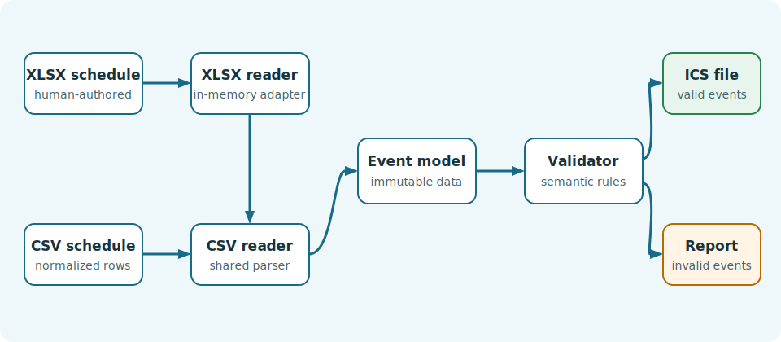

Application architecture
========================

The application separates file decoding, event representation, validation,
generation, and command-line coordination separate. Both input formats reach
the same CSV parsing contract, so their behavior remains consistent.

The main responsibilities are:

* The XLSX reader converts worksheet cells to normalized CSV text in memory.
* The CSV reader parses rows into immutable :class:`~calendar_conversion.event.Event` objects.
* The validator applies shared semantic rules and reports every issue.
* The ICS generator creates one ``VCALENDAR`` with one ``VEVENT`` per event.
* The application selects the reader, skips invalid events, writes the output,
  and prints the report.

The model uses an inclusive end date for all-day events because that is natural
for human input. The generator adds one day when producing iCalendar's
exclusive ``DTEND``. Timed events use ``Europe/Rome`` timezone rules and are
converted to UTC, including daylight-saving changes.
