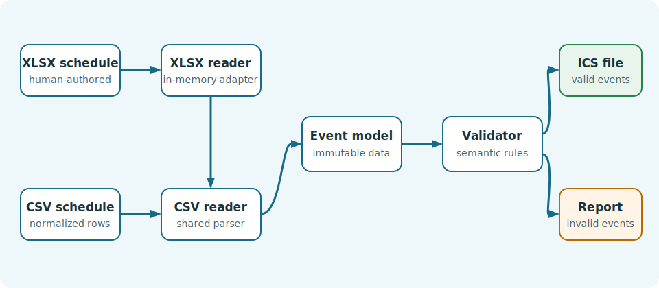

Calendar Conversion Application
===============================

``calendar-conversion`` turns a human-authored CSV or XLSX schedule into one
standards-based iCalendar (``.ics``) file. It validates events, skips invalid
entries, and prints a clear conversion report.

.. toctree::
   :maxdepth: 2
   :caption: Guide

   getting-started
   input-format
   architecture
   testing
   ai-usage
   api

Quick example
-------------

From the project root, with the virtual environment active:

.. code-block:: console

   $ python main.py
   === CONVERSION REPORT ===
   Input: events.xlsx
   Output: schedule.ics
   Valid and converted events: 3
   Invalid and not converted events: 0

The resulting ``schedule.ics`` can be imported directly by common calendar
applications.

Author
------

Developed by `Paolo Rossi <https://github.com/PaoloRos>`_.
